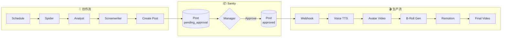

# MCN OS Architecture v2.0

**AI-Driven Video Production Pipeline**

> *"From Idea to Published Video, Human-in-the-Loop Automated"*

---

## System Overview (2-Flow Design)

The system uses **two decoupled workflows** connected via **Sanity CMS** as a state machine:

| Flow | Purpose | Trigger |
|------|---------|---------|
| **🎨 创作流 (Creative)** | Content planning & approval | Schedule / Manual |
| **🎬 生产流 (Production)** | Media generation & publishing | Sanity Webhook |




---

## Core Components

### 1. Control Plane (Sanity CMS)
| Schema | Purpose |
|--------|---------|
| `artist` | Digital persona definition (voice, wardrobe, studio) |
| `schedule` | When to generate content |
| `source` | Content sources (RSS, PDF, API) |
| `post` | Generated video projects |
| `prompt_config` | AI prompts (Analyst/Writer/Director) |

### 2. The Brain (n8n)
**Chain-of-Thought Processing via DeepSeek V3**

| Stage | Role | Output |
|-------|------|--------|
| **Analyst** | Extract key facts from raw input | Structured JSON |
| **Writer** | Apply persona, write script | Scene array with `script` |
| **Director** | Plan visuals for each shot | `visual_prompt` or `manual_asset` |
| **Editor** | Calculate frame timings | Remotion timeline JSON |

**Workflow:** `3_Orchestrator_V8_8.json`

### 3. GPU Middleware
| Component | Port | Function |
|-----------|------|----------|
| `FastAPI` | 8000 | Task submission (`/submit_task`) |
| `Redis` | 6379 | Job queue |
| `Worker` | - | Processes ComfyUI, CosyVoice, Remotion |

**Supported Task Types:**
- `comfyui` → Image/Video generation (Flux, WanVideo)
- `cosyvoice` → TTS audio generation
- `remotion_render` → Final video composition

### 4. Render Engine (Remotion)
| File | Purpose |
|------|---------|
| `Composition.tsx` | Video composition logic |
| `render.ts` | CLI render script |
| `remotion_driver.py` | Middleware integration |

**Timeline Format:**
```json
{
  "width": 1080,
  "height": 1920,
  "fps": 30,
  "durationInFrames": 1800,
  "clips": [{ "type": "avatar", "src": "videos/avatar.mp4", "layer": 0 }],
  "subtitles": [{ "text": "Hello", "startFrame": 0, "endFrame": 30 }]
}
```

---

## Data Flow

```
1. Trigger (Schedule/Webhook)
       ↓
2. Fetch Prompts (Sanity)
       ↓
3. Analyst (DeepSeek) → Intelligence JSON
       ↓
4. Writer (DeepSeek) → Script Array
       ↓
5. Director (DeepSeek) → Visual Plan
       ↓
6. Editor (JavaScript) → Timeline JSON
       ↓
7. Submit to Middleware
       ↓
8. GPU Worker → Remotion Render
       ↓
9. Output MP4 (assets/output/)
```

---

## Key Files

| Path | Description |
|------|-------------|
| `n8n/workflows/3_Orchestrator_V8_8.json` | Main brain workflow |
| `middleware/worker.py` | GPU task processor |
| `middleware/lib/remotion_driver.py` | Remotion integration |
| `rendering/src/Composition.tsx` | Video composition |
| `sanity-studio/schemaTypes/` | CMS schemas |
| `docker-compose.yml` | Service definitions |

---

## Environment

| Service | Host | Port |
|---------|------|------|
| n8n | Docker | 5678 |
| Sanity Studio | Local | 3333 |
| Middleware API | Host | 8000 |
| Asset Server | Docker | 8081 |
| ComfyUI | Host | 8188 |
| Redis | Docker | 6379 |
| Postgres | Docker | 5432 |

---

## Quick Start

```bash
# 1. Start infrastructure
docker compose up -d

# 2. Start GPU services
./start_comfy.sh &
./start_middleware.sh

# 3. Access n8n
open http://localhost:5678

# 4. Import & run workflow
# n8n → Import → 3_Orchestrator_V8_8.json → Execute
```

---

## Verified: 2026-01-07

- ✅ Full pipeline tested: Brain → Middleware → Remotion → MP4
- ✅ CosyVoice v3 Golden Environment working (English + Chinese)
- ✅ Output: 2.5MB video (60 seconds)
- ✅ All 10 n8n nodes executing successfully
