# Phase 10: Perception Layer Implementation Plan

**The Multi-Modal Intelligence Network**

> *"The Eyes and Ears of the AI Artists"*

---

## Executive Summary

This phase adds the **Perception Layer** - the system's ability to actively monitor and ingest content from diverse sources (YouTube, Twitter, Web). Each AI Artist can subscribe to different sources, receiving tailored intelligence based on their niche.

**Key Insight from Gemini Analysis:**
- ❌ **Reject**: Kafka/K8s over-engineering (single 4090 machine)
- ❌ **Defer**: Vector DB routing (explicit Sanity subscriptions are clearer)
- ✅ **Adopt**: "Swiss Cheese" method (transcripts + thumbnails, no video downloads)
- ✅ **Adopt**: RSSHub as universal feed converter
- ✅ **Adopt**: Three-color pipeline model

---

## Architecture: Three-Color Pipeline

```mermaid
graph TD
    subgraph Sources["📡 Source Types"]
        YT[YouTube Channel]
        TW[Twitter/X Account]
        WEB[Blog/News Site]
    end

    subgraph Radar["🔥 RSSHub (Universal Radar)"]
        RSS[RSS XML Feed]
    end

    subgraph Pipelines["🎨 Processing Pipelines"]
        RED["🔴 YouTube Pipeline
        yt-dlp → Transcript"]
        BLUE["🔵 Twitter Pipeline
        Firecrawl → Screenshot"]
        GREEN["🟢 Web Pipeline
        Firecrawl → Markdown"]
    end

    subgraph Brain["🧠 DeepSeek Processing"]
        ANALYST[Analyst + AI Instruction]
    end

    subgraph Dispatch["📬 Dispatch"]
        SANITY[Query Subscribed Artists]
        DRAFT[Create Draft Posts]
    end

    YT --> RSS
    TW --> RSS
    WEB --> RSS
    RSS --> n8n
    n8n -- platform=youtube --> RED
    n8n -- platform=twitter --> BLUE
    n8n -- platform=web --> GREEN
    RED --> ANALYST
    BLUE --> ANALYST
    GREEN --> ANALYST
    ANALYST --> SANITY --> DRAFT
```



---

## 1. Infrastructure (Docker)

### New Services

| Service | Image | Port | Purpose |
|---------|-------|------|---------|
| RSSHub | `diygod/rsshub` | 1200 | Universal RSS converter |
| yt-dlp-server | `mbrrg/yt-dlp-server` | 8082 | YouTube transcript extraction |
| Firecrawl | `mintplexlabs/firecrawl` | 3002 | Web scraping + screenshots |
| Playwright | `mcr.microsoft.com/playwright` | 3000 | Headless browser for Firecrawl |

### docker-compose.yml Additions

```yaml
services:
  # 📡 RSSHub - Universal Feed Converter
  rsshub:
    image: diygod/rsshub:latest
    container_name: mcn_rsshub
    ports:
      - "1200:1200"
    environment:
      - CACHE_TYPE=redis
      - REDIS_URL=redis://redis:6379/
      # - PROXY_URI=http://proxy:port  # For Twitter/YouTube
    depends_on:
      - redis
    networks:
      - mcn_network

  # 👂 yt-dlp API - YouTube Transcript Extraction
  ytdlp:
    image: mbrrg/yt-dlp-server:latest
    container_name: mcn_ytdlp
    ports:
      - "8082:8080"
    volumes:
      - ./assets/temp:/downloads
    networks:
      - mcn_network

  # 🔥 Firecrawl - Intelligent Web Scraper
  firecrawl:
    image: mintplexlabs/firecrawl:latest
    container_name: mcn_firecrawl
    ports:
      - "3002:3002"
    environment:
      - REDIS_URL=redis://redis:6379
      - PLAYWRIGHT_MICROSERVICE_URL=http://playwright-service:3000
    depends_on:
      - redis
      - playwright-service
    networks:
      - mcn_network

  # 🎭 Playwright - Headless Browser
  playwright-service:
    image: mcr.microsoft.com/playwright:v1.40.0-jammy
    container_name: mcn_playwright
    command: npx playwright run-server --port 3000
    expose:
      - "3000"
    networks:
      - mcn_network
```

---

## 2. Sanity Schema Updates

### 2.1 Upgrade source.ts

Add `platform` field for routing:

```typescript
{
  name: 'platform',
  title: '平台类型',
  type: 'string',
  options: {
    list: [
      { title: '🌐 网页 (Markdown)', value: 'web' },
      { title: '📺 YouTube (Transcript)', value: 'youtube' },
      { title: '🐦 Twitter/X (Screenshot)', value: 'twitter' },
      { title: '📰 RSS Feed', value: 'rss' }
    ]
  },
  initialValue: 'web',
  description: 'Determines which extraction pipeline to use'
},
{
  name: 'rsshub_route',
  title: 'RSSHub 路由',
  type: 'string',
  description: 'For YouTube: /youtube/user/@ChannelID, For Twitter: /twitter/user/Username'
}
```

### 2.2 Verify artist.ts

Already has `default_sources` - **No changes needed**.

---

## 3. n8n Workflow: The Spider

**Workflow Name:** `4_Intelligence_Spider.json`

### Node Flow

```
Schedule (30min) → Fetch Sources → Split → Platform Router
    ├── YouTube → RSSHub → yt-dlp → Transcript
    ├── Twitter → RSSHub → Firecrawl → Screenshot  
    └── Web → Firecrawl → Markdown
    → Dedupe (Redis) → DeepSeek Filter → Dispatch → Create Drafts
```

### 3.1 Trigger & Source Fetch

| Node | Type | Config |
|------|------|--------|
| Schedule | Interval | Every 30 minutes |
| Fetch Sources | HTTP (Sanity) | `*[_type == "source" && active == true]` |
| Split | SplitInBatches | Batch size: 1 |

### 3.2 Platform Router (Switch Node)

Route based on `{{ $json.platform }}`:

| Case | Value | Next Node |
|------|-------|-----------|
| 1 | youtube | YouTube Pipeline |
| 2 | twitter | Twitter Pipeline |
| 3 | web | Web Pipeline |
| Default | - | Web Pipeline |

### 3.3 Pipeline Implementations

#### 🔴 YouTube Pipeline

1. **RSS Read** (HTTP Request)
   - URL: `http://rsshub:1200/youtube/user/{{ $json.rsshub_route }}`
   - Extract: Video URLs from RSS items

2. **yt-dlp Extract** (HTTP Request)
   - URL: `http://ytdlp:8082/api/info`
   - Method: POST
   - Body: 
   ```json
   {
     "url": "{{ video_url }}",
     "subtitles": true,
     "auto_subs": true,
     "skip_download": true
   }
   ```
   - Output: `subtitles` (transcript) + `thumbnail`

#### 🔵 Twitter Pipeline

1. **RSS Read** (HTTP Request)
   - URL: `http://rsshub:1200/twitter/user/{{ $json.rsshub_route }}`

2. **Firecrawl Screenshot** (HTTP Request)
   - URL: `http://firecrawl:3002/v1/scrape`
   - Body:
   ```json
   {
     "url": "{{ tweet_url }}",
     "formats": ["screenshot@fullPage"],
     "waitFor": 2000
   }
   ```

#### 🟢 Web Pipeline

1. **Firecrawl Scrape** (HTTP Request)
   - URL: `http://firecrawl:3002/v1/scrape`
   - Body:
   ```json
   {
     "url": "{{ $json.url }}",
     "formats": ["markdown", "screenshot@fullPage"],
     "onlyMainContent": true
   }
   ```

### 3.4 Deduplication (Redis) ⚠️ UPDATED

Prevent reprocessing the same content.

> **Critical Fix #2 & #4**: Use native n8n Redis node (not `require('redis')`). Hash the stable `guid` or `url`, NOT the full content (which has dynamic elements like ads).

**Step 1: Code Node (Calculate Hash)**
```javascript
// Hash the stable identifier, not the full content
const crypto = require('crypto');
const stableId = items[0].json.guid || items[0].json.url;
const hash = crypto.createHash('md5').update(stableId).digest('hex');
return { json: { hash, ...items[0].json } };
```

**Step 2: Native n8n Redis Node**
- Operation: `SISMEMBER`
- Key: `processed_hashes`
- Value: `{{ $json.hash }}`

**Step 3: If Node**
- If result = 1: End (duplicate)
- If result = 0: Continue → Redis `SADD` → Process

---

### 3.5 Sanity Asset Upload ⚠️ CRITICAL

> **Critical Fix #1**: Sanity `image` fields require asset `_ref`, NOT raw URL strings.

**Image Upload Flow:**
```
Download Screenshot (Binary) → Sanity Upload Asset → Get assetId → Reference in Post
```

**n8n Implementation:**
1. **HTTP Request Node** (Download image as binary)
2. **Sanity Node** (Upload Asset)
   - Resource: Asset
   - Operation: Upload
3. **Set Node** (Extract `{{ $json._id }}`)
4. **Sanity Node** (Create Post with reference)
   ```json
   {
     "source_evidence": {
       "_type": "image",
       "asset": { "_ref": "{{ $json.imageAssetId }}" }
     }
   }
   ```

### 3.6 DeepSeek Filter (The Gatekeeper)

Not all scraped content should become videos:

```javascript
// System Prompt
const instruction = items[0].json.extraction_config.ai_instruction;
return {
  json: {
    model: "deepseek-chat",
    messages: [
      { 
        role: "system", 
        content: `You are an Intelligence Officer. ${instruction}
        If irrelevant, output: {"pass": false}
        If relevant, output: {"pass": true, "summary": "..."}`
      },
      { role: "user", content: items[0].json.content }
    ]
  }
};
```

### 3.7 Dispatch to Artists ⚠️ UPDATED

> **Critical Fix #3**: Sanity returns an **array** of subscribers. Use `SplitInBatches` to create separate posts for each.

**Step 1: Query Subscribers**
```groq
*[_type == "artist" && references($sourceId)] {
  _id,
  name,
  backstory,
  niche
}
```

**Step 2: SplitInBatches Node**
- Batch Size: 1
- This iterates through each artist individually

**Step 3: Create Draft Post (per artist)**
For each subscribed artist, create a separate Draft Post in Sanity.

---

## 4. Sanity Post Creation

When creating draft posts, include:

```json
{
  "_type": "post",
  "title": "{{ summary }}",
  "status": "draft",
  "artist": { "_ref": "{{ artist._id }}" },
  "source_content": "{{ scraped_content }}",
  "source_evidence": "{{ screenshot_url }}",
  "created_from_source": { "_ref": "{{ source._id }}" }
}
```

---

## 5. Implementation Checklist

### Infrastructure
- [ ] Add RSSHub to docker-compose.yml
- [ ] Add yt-dlp-server to docker-compose.yml
- [ ] Add Firecrawl + Playwright to docker-compose.yml
- [ ] Verify all services healthy

### Sanity Schema
- [ ] Add `platform` field to source.ts
- [ ] Add `rsshub_route` field to source.ts
- [ ] Add `source_content` and `source_evidence` to post.ts

### n8n Workflow
- [ ] Create `4_Intelligence_Spider.json`
- [ ] Implement Schedule trigger (30 min)
- [ ] Implement Platform Router (Switch)
- [ ] Implement YouTube pipeline (RSSHub + yt-dlp)
- [ ] Implement Twitter pipeline (RSSHub + Firecrawl)
- [ ] Implement Web pipeline (Firecrawl)
- [ ] Implement Redis deduplication
- [ ] Implement DeepSeek filter
- [ ] Implement Artist dispatch

### Verification
- [ ] Test YouTube channel monitoring
- [ ] Test Twitter account monitoring
- [ ] Test Web/Blog monitoring
- [ ] Verify deduplication works
- [ ] Verify correct artist dispatch

---

## 6. Example Use Cases

### "老K" (Finance Analyst)
- **Subscriptions**: Elon Musk Twitter, Federal Reserve Blog
- **Pipeline**: Twitter → Screenshot → DeepSeek analysis
- **Output**: Financial commentary videos

### "熊猫" (Kids Content)
- **Subscriptions**: Cocomelon YouTube, Disney Kids Blog
- **Pipeline**: YouTube → Transcript → DeepSeek adaptation
- **Output**: Chinese children's song videos

### "Luna Tech" (Tech Reviewer)
- **Subscriptions**: TechCrunch, Verge, Apple Newsroom
- **Pipeline**: Web → Markdown → DeepSeek summary
- **Output**: Tech news commentary videos

---

## 7. Cost Analysis

| Component | Cost | Notes |
|-----------|------|-------|
| RSSHub | Free | Self-hosted |
| yt-dlp | Free | Self-hosted |
| Firecrawl | Free | Self-hosted |
| DeepSeek API | ~$0.001/call | Filter + Analysis |
| **Total/day** | **~$0.50** | At 500 items/day |

---

## 8. Security Considerations

- **Proxy Required**: Twitter and YouTube may require proxy for reliable access
- **Rate Limiting**: RSSHub has built-in caching (Redis)
- **Account Rotation**: For Twitter, consider multiple guest accounts
- **Content Filtering**: DeepSeek filter prevents inappropriate content

---

*Estimated Implementation Time: 4-6 hours*
