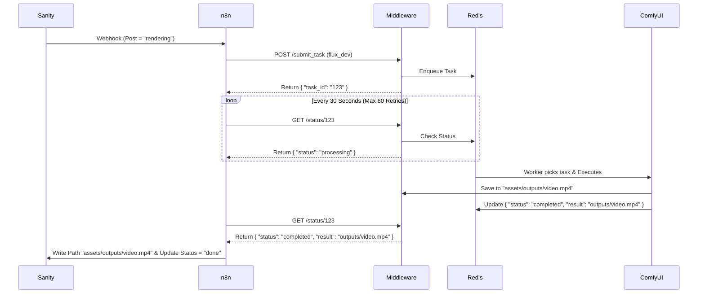

# Phase 7: The Final Link (End-to-End Integration)

## 📌 Context
We have built:
1.  **Sanity CMS**: The Brain (Content, Schemas, Status).
2.  **Middleware**: The Factory (Async Queue, GPU Worker, VRAM Management).
3.  **n8n**: The Orchestrator (Polling Architecture).

**Objective**: Connect **n8n** to the **Middleware API** to automate video production.

---

## 🏗️ Architecture: The "Ticket System"
We adopt the **Polling Pattern** (Deep Think Recommended) to prevent HTTP timeouts.



---

## 🛠️ Implementation Specs (Antigravity x Deep Think)

### 1. Networking (Critical Fix)
*   **The Trap**: `http://localhost:8000` works for you, but **fails inside n8n Docker**.
*   **The Trap 2**: `http://middleware:8000` (Deep Think suggestion) works only if Middleware is dockerized (it's not yet).
*   **The Solution**: Use the **Docker Host IP**.
    *   **Linux**: `http://172.17.0.1:8000/submit_task`
    *   **Mac/Win**: `http://host.docker.internal:8000/submit_task`

### 2. Parameter Injection
*   **Strategy**: "Smart Templates" (User Friendly).
*   My middleware supports *both* Node IDs and Handlebars placeholders. We will use placeholders for simplicity.
*   **Payload**:
    ```json
    {
      "task_type": "comfyui",
      "priority": 100,
      "payload": {
        "template": "flux_dev",
        "params": {
           "POSITIVE_PROMPT": "{{ $json.body.prompt }}",
           "SEED": {{ Math.floor(Math.random() * 1000000000) }}
        }
      }
    }
    ```

### 3. Loop Safety (Deep Think Fix)
*   **Max Retries**: 60 (30 mins max).
*   **Timeout Action**: If > 60 retries, send "Error" status to Sanity.

### 4. Zero-Blob Storage (Deep Think Fix)
*   **Action**: Do **NOT** upload the video file to Sanity.
*   **Logic**:
    *   Middleware returns relative path: `outputs/video_123.mp4`.
    *   n8n prefix: `/home/node/assets/` + `outputs/video_123.mp4`.
    *   Sanity Field: `local_render_path` (String).
*   **Benefit**: Saves bandwidth, instant "upload".

---

## 📋 n8n Workflow Checklist (`2_Post_Generator.json`)

### Nodes to Add:
1.  **Webhook**: 
    *   Filter: `_type == 'post' && status == 'rendering' && before().status != 'rendering'` (Prevent Recursion Storm).
2.  **HTTP Request (Submit)**:
    *   URL: `http://172.17.0.1:8000/submit_task`
3.  **Set (Init)**: `retries = 0`
4.  **Wait**: 30s
5.  **HTTP Request (Check)**: `http://172.17.0.1:8000/status/{{task_id}}`
6.  **Switch**:
    *   `completed` → Update Sanity (Done).
    *   `failed` → Update Sanity (Rejected).
    *   `queued/processing` → Increment Retries → **If** < 60 Loop Back, **Else** Fail.

---

## 🚀 Execution Steps
1.  **Update n8n Workflow**: Apply the loop logic.
2.  **Verify Volume**: Ensure `docker-compose.yml` has `- ./assets:/home/node/assets`.
3.  **Test**: Trigger a Post in Sanity.
